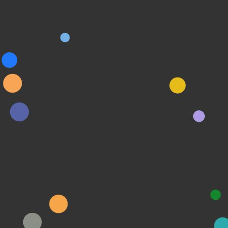

# Particle Simulation

This project is a simple particle simulation that demonstrates basic physics concepts like gravitational attraction between particles. It is implemented using p5.js, a JavaScript library that makes it easy to create graphical simulations.

## Particle Class

The `Particle` class represents a single particle in the simulation. Each particle has properties like position, velocity, acceleration, mass, radius, and color.

### Properties

- `position`: A p5.Vector representing the particle's position in the canvas.
- `velocity`: A p5.Vector representing the particle's velocity.
- `acceleration`: A p5.Vector representing the particle's acceleration.
- `mass`: A number representing the mass of the particle.
- `radius`: The radius of the particle, calculated based on its mass.
- `color`: A randomly generated color for the particle.

## How to run
- download the repo files
- open the index.html file with a browser

